# En jämförande studie av Playwright och Cypress: Styrkor och svagheter inom testautomation

| Namn                  | Linus Zackrisson Andersson                                      |
| --------------------- | --------------------------------------------------------------- |
| Utbildning            | Programvarutestare - PVT22                                      |
| Handledare/examinator | Benjamin Berglund                                               |
| Datum inlämning       | 2024-06-07                                                      |

# Innehållsförteckning
- [En jämförande studie av Playwright och Cypress: Styrkor och svagheter inom testautomation](#en-jämförande-studie-av-playwright-och-cypress-styrkor-och-svagheter-inom-testautomation)
- [Innehållsförteckning](#innehållsförteckning)
- [Sammanfattning](#sammanfattning)
    - [Förkortningar](#förkortningar)
- [Inledning 1](#inledning-1)
  - [Bakgrund 1.1](#bakgrund-11)
  - [Syfte 1.2](#syfte-12)
  - [Problemformulering 1.3](#problemformulering-13)
  - [Avgränsningar och fokus 1.4](#avgränsningar-och-fokus-14)
  - [Metod/Arbetssätt 1.5](#metodarbetssätt-15)
- [Teori 2](#teori-2)
  - [Hastighet 2.1](#hastighet-21)
  - [Användarvänlighet och grafiskt gränssnitt 2.2](#användarvänlighet-och-grafiskt-gränssnitt-22)
    - [Testrapporterare (show-report) 2.2.1](#testrapporterare-show-report-221)
    - [Webbläsare 2.2.2](#webbläsare-222)
  - [Installation 3.3](#installation-33)
  - [Internet referenslista 3.4](#internet-referenslista-34)
- [Resultat 3](#resultat-3)
  - [Hastighet 3.1](#hastighet-31)
  - [Användarvänlighet och grafiskt gränssnitt 3.2](#användarvänlighet-och-grafiskt-gränssnitt-32)
    - [Testrapporterare (show-report) 3.2.1](#testrapporterare-show-report-321)
    - [Webbläsare 3.2.2](#webbläsare-322)
  - [Installation 3.3](#installation-33-1)
  - [Syntax 3.4](#syntax-34)
- [Diskussion 4](#diskussion-4)
- [Slutsatser 5](#slutsatser-5)
  - [Rekommendationer 5.1](#rekommendationer-51)
- [Referenslista 6](#referenslista-6)
- [Bilagor 7](#bilagor-7)

# Sammanfattning

Examensarbetet syftar till att jämföra de två testverktygen Cypress och Playwright för att utvärdera deras styrkor och svagheter inom olika områden, inklusive grafiskt gränssnitt, användarvänlighet, testrapporter (show-report), webbläsare, installation och syntax. Studien genomfördes genom praktisk testning av ett egenutvecklat spel med båda verktygen. Resultaten visar att Playwright erbjuder parallell körning, bättre stöd för HTML-testrapporter, linjär och lättläst syntax samt färre steg för att komma igång med testningen. Cypress erbjuder sekventiell körning av tester, nybörjarvänligt och lättförståeligt syntax samt en stor gemenskap som ger stöd till utvecklare. Syftet är att ge läsaren en tydligare överblick över vilket verktyg som passar bäst för deras specifika behov.

<!-- Detta är en sida som skall sitta direkt efter titelsidan. Den innehåller först och främst en sammanfattning av innehållet i rapporten. Sammanfattningen ska innehålla bakgrund/inledning, beskrivning av examensarbetets genomförande samt resultat i korthet.

I sammanfattningen ska det endast redovisa resultat, slutsatser eller annat som finns med i själva arbetet. Finns det inte med i texten ska det inte stå med här.

Lista över förkortningar och begrepp

Inled arbetet med att lista (i bokstavsordning och gärna i tabellformat) alla förkortningar och begrepp som används i rapporten. Även för en tekniskt kunnig person kan det vara svårt att hålla betydelsen av alla förkortningar i huvudet och vissa förkortningar/begrepp som används i olika sammanhang, kan ha olika betydelser.

Denna rubrik kan tas bort om det inte finns begrepp och förkortningar som behöver förklaras.

Översätt inte bara förkortningens innebörd, utan förklara med egna ord vad det är för något. Till exempel: -->
### Förkortningar

| Akronym | Hela namnet                 | Beskrivning                                                                                 |
| ---     | ---------------------       | --------------------------------------------------------------------------------------------|
| UI      | User Interface              | Det användaren ser när hen besöker en hemsida samt interaktionen mellan sidan och användaren|
| JSON    | JavaScript Object Notation  | Ett kompakt, textbaserat format som används för att utbyta data. Formatet är utformat för att enkelt fungera med Javascript|
| HTML    | HyperText Markup Language   | Ett märkspråk som utgör strukturen för alla internets webbsidor|
| CI      | Continuous Integration      | Praxis att frekvent integrera ändringar i källkoden och säkerställa att den integrerade kodbasen är i ett fungerande tillstånd.|

# Inledning 1

<!-- Här börjar rapportens huvuddel. Huvuddelen skall delas in i numrerade kapitel och, i förekommande fall, i numrerade underavsnitt med beskrivande underrubriker. Hur indelningen med kapitelrubriker och underrubriker ska göras styrs i hög grad av det ämne som rapporten behandlar. Här visas enbart ett exempel. Ni får god hjälp hur ni skall bygga upp och skriva rapporten genom att studera litteratur om rapportskrivning, samt den instruktion som ges på kursen. Disposition och utformning av rapporter inom teknikområdet följer ofta speciella traditioner.

Sidorna i huvuddelen numreras löpande med början på 1. Genomgående i denna mall används teckensnittet Times New Roman (textstorlek 12 och 1,15 radavstånd) med följande undantag:

* i rubriker används Arial fet,
* för listning av programkod används Courier

Observera att varje yrkeshögskoleanordnare eventuellt har egna formaliaregler och instruktioner kring detta.

I examensarbetets inledning ska ni ge en kortfattad inledning till varför ni just valt detta område/ämne. Om ni skriver examensarbetet kopplat till LIA ska ni även beskriva er LIA-plats samt övergripande information om LIA-företaget. -->

Examensarbetet kom som en idé från min lärare, men idén om att jämföra Cypress med Playwright kom från en som jobbade på Zignsec, företaget där LIAN utfördes. Playwright är ett modernare testverktyg än Cypress och är mer aktuellt att jämföra än andra testverktyg. Jag tyckte att det var intressant att skapa ett litet spel, som användes för att jämföra de olika testverktygen. 

## Bakgrund 1.1

**Vad är Cypress?**

Cypress är ett "open-source", front-end/API testverktyg, byggt på Node.js och är skapat av företaget Cypress.io. Brian Mann och Gleb Bahmutov är två viktiga personer som var med och utvecklade Cypress. Cypress använder Javascript när man skriver testerna, men mycket av testkoden kan skrivas med Cypress inbyggda kommandon. Cypress är tänkt att automatisera och utföra handlingar som att fylla i former, klicka på knappar, och navigera sidor. Cypress har en [dokumentation](https://docs.cypress.io/guides/overview/why-cypress) som går att besöka för att lära sig mer om testverktyget.

**Vad är Playwright?**

Playwright är ett "open-source", front-end testverktyg och är skapat av Microsoft. Det skapades för att utvecklare ska kunna testautomatisera webbapplikationer. Playwright tillåter utvecklarna att utföra handlingar som att fylla i former, klicka på knappar, och navigera sidor. Programmeringspråk som stödjs av Playwright är: JavaScript, TypeScript, Python och Java. Det finns en [dokumentation](https://playwright.dev/docs/intro) som täcker det mesta av det som går att göra med Playwright.

**Varför gör jag det här projektet?**

Projektet är tänkt att få läsaren att förstå mer om de både testverktygen för att sedan göra en bedömning om vilken av testverktygen hen vill använda.

<!-- Under rubriken bakgrund skall ni beskriva bakgrunden till arbetet. Det är orsakerna till och beskrivningen av problemet, eller företagets situation, som skall beskrivas.

Beskriv vad ni ska göra i projektet och varför ni gör projektet. Som läsare vill jag förstå varför en fördjupning inom det här området har ett värde för yrkeskåren, er eller er kompetens när ni ska ut i arbetslivet. -->

## Syfte 1.2

Syftet med arbetet är att jämföra de två olika testverktygen Cypress och Playwright för att få en överblick över deras styrkor och svagheter med fokus på följande områden:

- Hastighet
- Grafiskt gränssnitt
- Användarvänlighet
- Testrapporterare (show-report)
- Webbläsare
- Installation
- Syntax

Idén är att få en överblick av testverktygens stykor och svagheter och sen får läsaren själv bestämma sig för vilket av dem de tänker använda sig av.
<!-- Varför gör ni undersökningen och vad vill ni att undersökningen skall leda till. Själva syftet ska formuleras i en mening: ”Syftet med arbetet/uppsatsen är att......” -->


## Problemformulering 1.3

<!-- Här beskriver ni vilket problem ni står inför. Försök att besvara frågan:

Vad ska göras i arbetet? Med utgångspunkt från syftet ska ni här formulera konkreta frågeställningar. Ni skall visa hur ni valt att strukturera och dela upp syftet med er undersökning. Frågeställningarna bör inte vara färre än tre eller fler än fem. Tänk på att göra problemformuleringen så snäv som möjligt så inte undersökningen blir för stor. -->

<!-- Frågeställningarna ska inte vara ja-och nejfrågor utan öppna frågor, t.ex. hur kan… på vilket sätt… ? -->

Vilka skillnader finns det mellan Playwright och Cypress när det gäller deras grafiska gränssnitt?

Vilka skillnader finns det mellan Playwright och Cypress när det gäller användarvänlighet?

Vilka skillnader finns det mellan Playwright och Cypress när det gäller exekvering av kod och hastighet?

Hur skiljer sig installationsprocessen mellan Playwright och Cypress?

Hur skiljer sig syntaxen mellan Playwright och Cypress?


## Avgränsningar och fokus 1.4

Detta kommer inte finnas med:

- Jämförande av genomsnittlig hastighet i sekunder mellan de två testverktygen. Det finns ingen anledning till att jämföra det, eftersom Playwrights tester körs parallellt lokalt, och det gör inte Cypress.
- En omfattande analys av både testverktygens grafiska gränssnitt.
- En mer övergripande analys av testverktygens rapporterare. Det skulle ta för mycket tid att jämföra alla rapporterare, så jag håller mig till "npx playwright show-report" och en av Cypress motsvarande "cypress-mochawesome-reporter".

<!-- Här gör ni ett förtydligande av vad ni avser att INTE studera i ert arbete. Detta görs för att det inte ska finnas förväntningar från opponent/läsare att det finns med. Att välja fokus är att avgränsa sig på ett mjukare sätt. Att välja fokus innebär att studenten motiverar varför vissa inriktningar väljs eller väljs bort. -->


## Metod/Arbetssätt 1.5

Jag har för avsikt att avgöra vilket testverktyg mellan Playwright och Cypress som är mest effektivt inom de olika områdena som jag har beskrivit under Syfte. Jag kommer att testa ett spel som jag har skapat med båda testverktygen för att få en klarare bild av hur bra de olika verktygen presterar inom respektive område. Analysen av det grafiska gränssnittet och användarvänligheten kommer att baseras på:

- Start av testverktygen
- Testfönstrets grafiska gränssnitt
- Testrapporterare (show-report)
- Webbläsare

Installationen av testverktygen kommer att bedömas utifrån deras dokumentation samt egna observationer, medan syntaxen kommer att analyseras baserat på egna observationer när jag skriver testerna, samt genom referenser från dokumentationen.

Bilder finns i bilagorna för att ge en mer visuell förståelse av resultatbeskrivningarna.


<!-- Hur ska arbetet/undersökningen genomföras? Alla undersökningar genomförs med kända och väl verifierade metoder. Dessa lämpar sig för olika typer av syften. Det är viktigt att metoden överensstämmer med syftet, liksom att ni väljer rätt verktyg för undersökningen av problemet.

Vi har för avsikt att: (någon av följande)

Beskriva (händelser, tillstånd, förlopp, handlingar för att därur kunna dra slutsatser för beslut. För att vara meningsfull måste varje beskrivning återkopplas till syftet.)

Förklara (Ert syfte är att göra en modell av verkligheten för att den lättare skall kunna förklaras)

Förstå (ni söker kunskap om vissa förhållanden)

Förutsäga (Hur ser vår prognos inför framtiden ut?)

Besluta (Vilka är handlingsalternativen inför ett beslut?)

Ni ska i första hand använda kvalitativ och/eller en kvantitativ metod för er undersökning. Beroende på vad som ska undersökas, kan enbart en av metoderna användas.

Kvalitativa metoder (det är vad som kommer fram i svaren som är det viktiga, inte antalet svar):

- Observationer
- Intervjuer

Kvantitativa metoder (det är antalet svar som är viktiga, inte vad svaret är eller varför):

- Statistiska verktyg
- Enkäter

Gäller praktiskt arbete:

Beskriv systematiskt och tydligt vad och hur ni gjort. När ni redovisar det praktiska arbetet är det viktigt att systematiskt beskriva de olika delarna av arbetet och resonera för- och nackdelar med gjorda val.

Använd figurer och bilder i den här rapporten för att beskriva särskilt intressanta delar av det praktiska arbetet.

Gäller teoretiskt arbete:

Beskriv systematiskt och tydligt vad och hur ni gjort. Inkludera all information som behövs för att läsaren ska förstå och få förtroende för det ni har gjort, dvs att arbetet har gjorts på ett pålitligt sätt.

Det vara en fördel att beskriva ordningen på de olika momenten eller beskriva de olika arbetssätten ni valt. Ibland kan det vara en fördel att använda bilder och figurer för att förklara på ett bra sätt. -->

# Teori 2

## Hastighet 2.1

Enligt Pathak (2024) stöds inte parallell körning av tester med Cypress. För att köra tester parallelt med Cypress, behöver användaren dela upp testerna över flera filer. Pathak skriver att Playwright stödjer parallellisering av tester, även när de körs lokalt[[L8]](#link-8). Tester går att köra parallellt i en testfil. Tej (2023) skriver också att det är en fördel för Playwright att det går att köra tester parallellt[[L9]](#link-9). Backer skriver en viktig sak som glömdes ta upp i resultatet[[L10]](#link-10), jag citerar: 

**Playwright**

> Playwright provides the ability to execute tests in parallel across multiple machines. The default setting is to run test cases in a single
> worker, but it is possible to run tests in parallel on different machines by specifying the number of workers. This can be done through the 
> command line by using the command “npx playwright test –workers 4,” where “4” represents the desired number of workers. Another option is to 
> configure the workers in the playwright.config.js file.

**Cypress**
> Cypress has been specifically designed not to run tests in parallel on a single local machine. This restriction is detailed in the official 
> Cypress documentation, with several reasons cited. However, if your project already has Continuous Integration in place, it is possible to set 
> up parallel tests in CI by following the guidelines provided in the Cypress documentation. The framework’s approach to parallelization is based 
> on file separation, so to take advantage of this feature, your tests need to be organized into separate files.

Enligt Backer det är möjligt att skriva tester i parallellt i Cypress med användning av CI - Continuous Integration.

I Backer's citat gällande Playwright, har han av misstag missat ett bindesträck i "npx playwright test –workers 4". Här är hur det ska stå:


Som ni ser ändras "workers" till fyra istället.

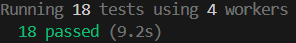

 Backer har också skrivit att standard är att en "worker" används, men när standard skriptet "npx playwright test" skrivs in i terminalen, står det att det används åtta "workers".

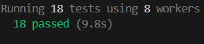

## Användarvänlighet och grafiskt gränssnitt 2.2

**Playwright**

Enligt Del Puppo[[L11]](#link-11) används kommandot `npx playwright run --ui` för att starta ett fönster med Playwright, "The result of this command is a new window in your display!". Del Puppo skriver, jag citerar: 
>Using this view, you can run and debug your test. But let's dive into it.
>The view is split into two parts: the left part contains the list of the tests, and the right part is the crucial view to check and debug the 
>tests.

**Cypress**

Det finns inte lika många artiklar som beskriver Cypress grafiska gränssnitt för testsidan på ett detaljerat sätt som går att jämföra med resultatet. Resultaten är baserade på egna observationer i gränssnittet och dokumentation från Cypress.io[[L16]](#link-16)[[L17]](#link-17).

### Testrapporterare (show-report) 2.2.1

Enligt Backer (2024) har Playwright inbyggt stöd för några testrapporterare och har förmågan att konfigurera rapporterarna[[L10]](#link-10) och författaren för Playwright Reporting (2023) skriver[[L12]](#link-12), jag citerar:
> Playwright reporting gives a built-in option for reporters. You can generate it by passing the reporter in the command line or specifying it in the Playwright configuration file.
>
> Before we get into actual test reporters, let's quickly set up the Playwright framework and run the example tests to see tests in action, and further, you will use it to create working example code.
>
> Following are the Playwright built-in reporters:
>
> - List Reporter
> - Line Reporter
> - Dot Reporter
> - HTML Reporter
> - JSON Reporter
> - JUnit Reporter
> - GitHub Actions annotations

Enligt Backer (2024 ) har Cypress en standard "spec reporter" som går att konfigurera med andra rapporterare som Cypress stödjer. Backer skriver att Cypress är byggt utifrån Mocha, så alla rapporterare som är gjorda för Mocha kan användas av Cypress[[L10]](#link-10).  

Bhat och Hegdeg (2022) har gjort en steg för steg guide för installation av `cypress-mochawesome-reporter`[[L13]](#link-13):

>Step 1: Install  Cypress reporter, using Terminal install cypress-mochawesome-reporter, with command
>
>`npm i --save-dev cypress-mochawesome-reporter`
>Step 2: Configure Cypress Reporter
>
>Navigate to your cypress configuration file, typically the name will `cypress.config.js`
>
>Add the below line of code
>
>//cypress.config.js
>```javascript
>const { defineConfig } = require("cypress");
>
>
>module.exports = defineConfig({
>
> reporter: 'cypress-mochawesome-reporter',
>
>  e2e: {
>
>    setupNodeEvents(on, config) {
>
>     require('cypress-mochawesome-reporter/plugin')(on);
>
>    },
>
>  },
>
>});
>```
>The reporter is mentioned as the ‘cypress-mochawesome-reporter’, which you installed in step 1.
>
>Cypress 10 and above version has a separate part for e2e tests, inside that you need to add the 
>required statement as shown above.
>
>Step 3: Configure Support e2e.js
>
>Navigate to cypress/support/e2e.js, and add the import statement using the command below.
>
>import `'cypress-mochawesome-reporter/register';`
>
>The above Steps complete the basic HTML reporter setup
>
>Step 4: Execute your tests
>
>Execute your tests with the below command
>
>`npx cypress run --e2e`
>
>Alternatively, you can also execute using npm run test, if you have configured scripts in package.json
>
>Step 5: View HTML reports
>
>Once the execution is complete, Cypress Generates the HTML report. Navigate to the folder with the 
>name “reports”, you will find the HTML report as seen below
>

Bhat och Hegdegs version av installationen av cypress-mochawesome-reporter skiljde sig något från resultatet, men det viktigaste är att Cypress HTML-reporter inte är inbyggd, vilket kan vara problematiskt för nya användare.

### Webbläsare 2.2.2

Enligt GH (2023) stödjer Playwright Chrome familjens webbläsare (Chrome, Edge), Webkit (Safari), och Firefox[[L14]](#link-14). Solderea (2023) skriver också att det är dem webbläsarna som Playwright stödjer[[L15]](#link-15).

Enligt Tej (2023) stödjer Cypress Chrome, Firefox, och Edge[[L9]](#link-9). Solderea (2023) skriver att Google Chrome, FireFox, Edge, Electron och WebKit stödjs (Med hjälp av Playwright)[[L15]](#link-15). Tej nämner också en av Cypress nackdelar när det gäller exekvering av test: "Inability to instantiate multiple browsers simultaneously."

## Installation 3.3

Enligt Solderea (2023) är det här stegen för installation av Playwright respektive Cypress[[L15]](#link-15):

**Playwright**

> 1. Pre-requisites: NodeJS should already be installed.
> 2. Setup Playwright using the command `npm init playwright@latest` and answer the below questions:
>  - Do you want to use TypeScript or JavaScript?
>  - Where to put your end-to-end tests?
>  - Add a GitHub Actions workflow?
>  - Install Playwright browsers?
> 
> Do not worry; all of the above sections can be answered with yes or no, as seen below.

**Cypress**

> 1. Pre-requisites: NodeJS should already be installed.
> 2. Generate package.json using the command npm init.
> 3. Install the latest version of Cypress using the command npm install cypress — save-dev.
> 4. Once that is done, simply type `npx cypress open`. At the time of writing this blog, the latest version of Cypress was 12.7.1.

Installationen av Cypress och Playwright stämmer överens med mina observationer. Vilken som är bäst, bestämmer användaren.

## Internet referenslista 3.4

<a name="link-8"></a>
<font color="blue">L8</font>Pathak, K. (2024) Cypress vs Playwright: A Comparative Analysis, hämtad från https://testgrid.io/blog/cypress-vs-playwright/

<a name="link-15"></a>
<font color="blue">L15</font>Solderea, I (2023) Cypress vs Playwright: A Detailed Comparison, hämtad från https://www.lambdatest.com/blog/cypress-vs-playwright/

<a name="link-9"></a>
<font color="blue">L9</font>Tej, K (2023) Playwright vs Cypress: A Comparison, hämtad från https://www.browserstack.com/guide/playwright-vs-cypress

<a name="link-14"></a>
<font color="blue">L14</font>GH (okänt namn), (2023) Playwright Automation Framework: Tutorial, hämtad från https://www.browserstack.com/guide/playwright-tutorial

<a name="link-10"></a>
<font color="blue">L10</font>Backer, A (2024) Playwright vs. Cypress: Key Differences, hämtad från https://muuktest.com/blog/playwright-vs-cypress#playwright_vs._cypress:_a_comparison

<a name="link-13"></a>
<font color="blue">L13</font>Bhat, P & Hegdeg, G (2022) Understanding Cypress HTML Reporter, hämtad från https://www.browserstack.com/guide/cypress-html-reporter

<a name="link-12"></a>
<font color="blue">L12</font>Playwright Reporting, (2023) Playwright Reporting: A Complete Tutorial, hämtad från https://www.lambdatest.com/learning-hub/playwright-reporting

<a name="link-11"></a>
<font color="blue">L11</font>Del Puppo, L (2023) Playwright - UI Mode, hämtad från https://blog.delpuppo.net/playwright-ui-mode

<a name="link-16"></a>
<font color="blue">L16</font>Unknown, (2024) Opening the App, hämtad från https://docs.cypress.io/guides/getting-started/opening-the-app

<a name="link-17"></a>
<font color="blue">L17</font>Unknown, (2024) Your First Test with Cypress, hämtad från https://docs.cypress.io/guides/end-to-end-testing/writing-your-first-end-to-end-test

<!-- Uppsatsen teori handlar om att ”beskriva det som redan är skrivet”. Utifrån syfte och problemformulering letar ni upp lämplig teori där ni kan fördjupa er i frågeställningarna. Teorin ska knytas till det undersökningsresultat du/ni kommit fram till. Detta ska bekräftas eller dementeras.

Teorin kan t.ex. hämtas från:

* alternativa undersökningar
* vetenskapliga artiklar
* kurslitteratur eller annan litteratur

Källhänvisningar:


Under teoriavsnittet är det viktigt att ni gör källhänvisningar till allt ni skriver.

Nedanstående är exempel på de vanligaste systemen. Följ systemet angivet av utbildningsanordnare eller examinator.

* APA
* Harvardsystemet
* Oxfordsystemet

Kom ihåg att alltid vara källkritisk när ni arbetar med olika källor. Ställ frågor till aktuell källa:

* Vem har skrivit och i vilket syfte?
* Bekräftas källan av andra?
* Var är den publicerad, i en vetenskaplig/akademisk publikation eller i en veckotidning?

Sådana fakta som är självklar behöver inte refereras (tex. vi lever på 2000-talet). Detta är common sense. Det är bra att visa att man har gått till flera källor för att få något bekräftat eller för att visa på olika perspektiv/synsätt i en fråga.

Nätbaserade källor hänvisas med URL. Den första av internetkällor heter då URL1, andra URL2 etc. Hela internetlänken placeras sedan i referenslistan under en egen rubrik där.

Tabeller & Figurer

Under alla figurer måste anges figurnummer och figurtext. Figurer i kapitel X numreras löpande, Figur X.1, Figur X.2 etc. I löpande text refererar man till figurerna genom att skriva exempelvis ’Experimentuppställningen visas i Figur 3.2’. Tabeller numreras löpande liksom figurerna, Tabell X.1, Tabell X.2 med tabelltexten ovanför tabellen. -->

# Resultat 3

## Hastighet 3.1
<a name="back-1"></a>
<a name="back-2"></a>
Playwrights tester körs parallellt med varandra, vilket kan drastiskt öka hur snabbt alla tester genomförs. När testerna genomförs med Cypress exekveras testerna en efter en. I Playwright finns det en tid som går att observeras för varje test.[[1]](#bilaga-1) I Cypress finns en total tid för alla tester, men inte för varje enskilt test.[[2]](#bilaga-2)

**Analys:**

Playwrights parallellisering av testerna är fördelaktig för större projekt med mer komplexa/längre tester, medan Cypress sekventiella upplägg av testerna kan vara bättre för mindre projekt.

## Användarvänlighet och grafiskt gränssnitt 3.2

**Playwright**

1. Skriv kommandot/skriptet: npx playwright test --ui i terminalen.
2. Ett fönster bör dyka upp med det grafiska gränssnittet för testerna.[[L6]](#link-6)

Testerna kan ses på den vänstra sidan av fönstret, där det finns start, stop, watch all, collapse all knappar. Det går också att filtrera testerna med passed, failed, skipped samt välja om testerna ska köras med en eller flera webbläsare: Chromium, WebKit och Firefox parallellt eller inte. På den högra sidan finns en visuell bild för varje steg av testet, en tidslinje samt verktyg som stödjer användaren att felsöka och/eller skapa testkod (Locator, Source, Log, Errors, Console, Network, Attachments). Playwright-fönstret har även en knapp för nattläge.

**Cypress**

1. Skriv kommandot/skriptet: npx cypress open i terminalen.
2. Ett fönster bör dyka upp.
3. Tryck på E2E testing.
4. Tryck på den webbläsare du vill använda för testning.
5. Tryck på den fil du vill testa.
6. Det grafiska gränssnittet för testerna bör nu visas[[11]](#bilaga-11).

Likt Playwright, har Cypress testerna på den vänstra sidan av fönstret. Längst till vänster har Cypress knapparna Specs, Runs, Debug och Settings och Run All Tests, Stop Running för styrning av testerna. Runs och Debug tillhör Cypress Cloud och ger användaren tillgång till tester som spelats in tidigare, repris på de inspelade testen med debug-möjlighet genom användning av Cypress Test replay. Det är dock lite struligt att komma igång med Cypress Cloud och därför kommer det inte analyseras. På högra sidan av Cypress-fönstret finns:

- Visuella bilder för varje steg av testet
- En knapp som gör det möjligt att generera och kopiera selektorer
- Möjlighet att byta webbläsare för testningen
- Ändring av Viewport. Standard är 1000x660, men kan ändras i cypress.config.js
- Chromes egna konsol för debugging, källkod och mer

Playwright kan köra testerna i olika webbläsare parallellt och har en kortare process för att starta testerna i det grafiska gränssnittet. I övrigt har båda testverktygen ett liknande upplägg med knappar, visuella element, felsökning och generering av testkod, men Cypress vinner på hur många funktioner som finns: Cypress Cloud och Settings.

**Analys**

Playwrights kortare process underlättar för utvecklare som vill vara produktiva och snabbt komma igång med testningen, men Cypress har Cypress Cloud och Settings som tillåter utvecklare att använda mer avancerade verktyg.

<a name="back-7"></a>
<a name="back-8"></a>
Både Playwright och Cypress har en "selector" knapp som underlättar för användaren när hen skriver tester.[[7]](#bilaga-7)[[8]](#bilaga-8)

### Testrapporterare (show-report) 3.2.1

Playwright har inbyggt stöd för testrapporter som visas visuellt i en webbläsare. Kommandot för att visa rapporterna efter ett/flera test/tester har exekverats är `npx playwright show-report`. Testrapporten visar vilka test som passerar och vilka som misslyckas, och det går dessutom att trycka på de misslyckade testen för att se exakt vad de misslyckades med. Cypress har inte ett inbyggt stöd för html-testrapporter. Cypress-användaren behöver ladda ner ett npm package: `npm install --save-dev cypress-mochawesome-reporter` och `cypress.config.js` måste konfigureras. Det som är likt med Playwright och Cypress när det gäller testrapport är kommandona `npx playwright test` och `npx cypress run`. Det är kommandon för enklare testrapporter som visas i terminalen.

Steg för Playwright's "show-report":
1. Skriv `npx playwright test` i terminalen.
2. Skriv `npx playwright show-report`i terminalen.[[9]](#bilaga-9)<a name="back-9"></a>
3. En webbläsare bör dyka upp med testrapporterna.

Steg för Cypress's "show-report":
1. Installera cypress-mochawesome-reporter genom att skriva `npm install --save-dev cypress-mochawesome-reporter` i terminalen.
2. Konfigurera cypress.config.js filen med följande kod[[L7]](#link-7): 
```javascript
const { defineConfig } = require('cypress');
const mochawesome = require('cypress-mochawesome-reporter/plugin');

module.exports = defineConfig({
  e2e: {
    setupNodeEvents(on, config) {
      // Integrate the mochawesome plugin
      mochawesome(on);
      return config;
    },
    reporter: 'cypress-mochawesome-reporter',
    reporterOptions: {
      reportDir: 'cypress/reports',
      overwrite: false,
      embeddedScreenshots: true, // Option to embed screenshots in the report
      ignoreVideos: false, // Include videos in the report
      videoOnFailOnly: false, // Attach videos only to failed tests
      quiet: false, // Show console messages
      saveAllAttempts: true, // Save screenshots of all attempts
      debug: false, // Do not create a debug log file
      saveJson: true // Save the JSON file used to create the HTML report
    },
  },
});

```
3. Skriv `npx cypress run` i terminalen.[[10]](#bilaga-10)<a name="back-10"></a>
4. Den bör skapa en html fil i `cypress/reports` som går att öppna med live server.
5. En webbläsare öppnas upp med testrapportena, likt Playwrights show-report.

**Analys**

Playwright har inbyggt stöd för "show-report", vilket visar upp en HTML-baserad sida på testerna. Det är en fördel om användaren vill slippa konfigurera `config.js` filen eller installera ett nytt `npm package`.

### Webbläsare 3.2.2

Playwright stödjer Chromium, Firefox, WebKit, Google Chrome och Microsoft Edge[[L1]](#link-1), medan Cypress stödjer Chromium, Firefox, Google Chrome, Microsoft Edge och Electron[[L2]](#link-2), samt en mer experimentell version av WebKit. Det faktum att Playwright har ett mer omfattande stöd för WebKit är en fördel för dem som vill testa webbläsare för mobila enheter.

Playwright kan också parallellt köra test för varje webbläsare som de har stöd för.[[6]](#bilaga-6) <a name="back-6"></a>

**Analys**

Playwright har en fördel när det gäller WebKit och parallell exekvering av testerna i olika webbläsare.

## Installation 3.3
Notera att installationen av Playwright och Cypress kräver att du har installerat ®Node.js: `Node.js® is a free, open-source, cross-platform JavaScript runtime environment`.[[L5]](#link-5)

Playwright och Cypress har tydlig information om hur installationen av testverktyget går till:

**Playwright**[[L3]](#link-3)
<a name="back-3"></a>
<a name="back-4"></a>
<a name="back-5"></a>
1. Skriv `npm init playwright@latest` i terminalen.[[3]](#bilaga-3)
2. Gå igenom alla steg som dyker upp i terminalen.

**Cypress**[[L4]](#link-4)
1. Skriv `npm init` i terminalen.[[4]](#bilaga-4)
2. Gå igenom alla steg som dyker upp i terminalen.
3. skriv `npm install cypress --save-dev` i terminalen.[[5]](#bilaga-5)

**Analys**

Playwright har en installationsprocess som mer "samlad". Det är en väldigt linjär och lättförståelig installation.

## Syntax 3.4

Både Cypress och Playwright använder sig av asynkrona tester. Det innebär att testkoden kan köras utan att vänta på att tidigare operationer ska slutföras, vilket möjliggör att flera operationer kan köras parallellt eller vid olika tidpunkter.

**Playwright**

**Async/Await Syntax:** Playwright använder modern JavaScript-syntax med async och await för att hantera asynkrona operationer. Detta gör koden mer linjär och lättläst, särskilt för utvecklare som är bekanta med modern JavaScript.

**Kodexempel:**
```
await page.getByRole('button', { name: 'up' }).click() 
```

**Argumentet "page":** Varje testfunktion i Playwright använder ett argument som ofta heter "page". Detta argument representerar en webbläsarsida och används för att interagera med sidan när man skriver testerna.

**Kodexempel:**
```
test('example test', async ({ page }) => { ... })
```

**Cypress**

**"Kedjad" Syntax:** Cypress använder sig mycket av "kedje" syntax för att hantera asynkrona operationer. Detta innebär att flera kommandon kan "kedjas" ihop, annars hanterar Cypress väntetider och synkronisering automatiskt till skillnad från Playwright som använder `await` och `async`.

**Kodexempel:**
```
cy.get("selector").should('be.visible')
```

**Inga Argument Krävs:** I Cypress behöver man inte använda argument som "page" i testkoden, men det finns möjlighet att använda frivilliga argument om det behövs.

**Kodexempel:**
```
it('example test', () => { ... })
```

**Analys**

Playwright har en linjär och lättläst syntax, vilket gör att den är lätt att hitta fel i. Det kan vara lite svårare för nybörjare att sätta sig in i `await/async` och `page` tänket, medan Cypress har en nybörjarvänlig och lättförståelig syntax, vilket gör att det är lätt att förstå syntaxen och komma igång med testningen.
<!-- Här redovisar ni objektivt och utan värderingar era iakttagelser på ett strukturerat sätt vad ni kommit fram till i er undersökning/arbete. Hur blev det? Vad blev resultatet?

När ni redovisar ert resultat ska ni inte blanda in egna upplevelser, känslor eller någon analys. Ni ska enbart beskriva utfallet på er undersökning/arbete och enbart det som är centralt för resultatet. Så den här texten och/eller redovisning är saklig, formell och ”torr” och ni sparar era personliga reflektioner till texten under rubriken Diskussion. Mottagaren ska kunna se en röd tråd som löper från Bakgrund med syftet, avgränsningar och metodbeskrivning, och tydligt se hur detta leder fram till resultatet.

Har ni ställt frågor enligt ett frågeformulär är det lämpligt att redovisa svaren i en figur eller tabell. -->

# Diskussion 4

<!-- Här formulerar ni svaren på era frågeställningar och kontrollerar och reflekterar över om rapporten uppfyller syftet.

Stämde era antaganden? Löstes problemet? Förklara om det blev som ni tänkt er, beskriv vad ni lärt er och vad ni kunnat göra annorlunda för att få ett bättre resultat. Koppla tillbaka till de beslut som har fattats under resans gång och konsekvenserna av dem. Om något blev fel, så är det helt okej att berätta det här och beskriv vad ni lärt er av det och kanske hur det påverkat utfallet/resultatet.

Ni kan även diskutera noggrannheten/tillförlitligheten i arbetet och beskriva om det skiljer sig från liknande arbeten. Om ni har kommit fram till något annat resultat än andra som gjort liknande arbeten, beskriv varför ni tror att det är så.

Tänk på att inte låta den här texten bli full av undanflykter och ursäkter, utan snarare en saklig reflektion. -->

# Slutsatser 5

<!-- Utifrån den analys ni gjort i avsnittet ovan kan ni dra slutsatser utifrån syfte och frågeställningarna. Ett visst mått av subjektivitet är tillåtet men det måste vara motiverat av det som framkommit i uppsatsens analys.

Ibland går det dock inte att dra några säkra slutsatser, det ligger i forskningens natur, vilket också är ett resultat. Man förklarar då varför det inte gick att dra säkra slutsatser. -->

## Rekommendationer 5.1

<!-- Baserat på vad ni kommit fram till samt på undersökningens syfte, avger ni här er yrkesmässiga/professionella rekommendation till dem som kan dra nytta av undersökningens resultat. Här kan ni tänka fritt och diskutera ämnet ur ett mer subjektivt perspektiv. -->

# Referenslista 6

<!-- De källor ni använt ska redovisas i en referenslista. Den ska vara på ett eget blad och sist i arbetet.

I källförteckningen anger ni den litteratur ni har hänvisat till i texten. Referenslistan presenteras alltid i alfabetisk ordning. Han ni väldigt många källor kan ni även dela upp dessa i litteratur, internet, artiklar och muntliga källor. Glöm inte ange datum för internet och muntliga källor. Tips på hur du sammanställer en referenslista finns i anordnarens eller examinatorns guider.

Nedan finns exempel på de olika systemen.

Litteraturförteckning

Exempel APA

Bok - 1 författare

Ejlertsson, G. (2019). Statistik för hälsovetenskaperna (3 uppl.) Studentlitteratur.

Bok – 2 författare
Aldskogius, H., & Rydqvist, B. (2018). Den friska människan: anatomi och fysiologi. Liber

Internet


Folkhälsomyndigheten. (8 oktober 2019). Sjukdomsinformation om influensa. https://www.folkhalsomyndigheten.se/smittskydd-beredskap/smittsamma-sjukdomar/influensa-/

Browserstack. (14 Februrari 2023) Cypress vs Selenium: Key Differences. https://www.browserstack.com/guide/cypress-vs-selenium 

Exempel Harvard

Bok – 1 författare

Eklund, K. (2017). Vår ekonomi: en introduktion till samhällsekonomin.14 uppl., Lund: Studentlitteratur
Bryman, A. & Bell, E, Företagsekonomiska forskningsmetoder, 2. uppl., Stockholm: Liber AB, 2014. ISBN: 978-91-47-09822-4

Internet

Rhodin, M. (2018). Projekt Islandshäst. Rörelseforskning på häst och ryttare – en forskarblogg från SLU. [Blogg]. 17 maj. http://blogg.slu.se/rorelseforskning/2018/05/17/projekt-islandshast/ [2020-02-06] -->

**Internet**

<a name="link-1"></a>
<font color="blue">L1</font>, Browsers: Dokumentation om vilka webbläsare som stödjs av Playwright, hämtad från https://www.cuketest.com/playwright/docs/browsers/ 

<a name="link-2"></a>
<font color="blue">L2</font>, Launching Browsers: Dokumentation om vilka webbläsare som stöjds av Cypress, hämtad från https://docs.cypress.io/guides/guides/launching-browsers#Browser-versions-supported

<a name="link-3"></a>
<font color="blue">L3</font>, Installation: Dokumentation om installation av Playwright, hämtad från https://playwright.dev/docs/intro#installing-playwright

<a name="link-4"></a>
<font color="blue">L4</font>, Installing Cypress: Dokumentation om installation av Cypress, hämtad från https://docs.cypress.io/guides/getting-started/installing-cypress

<a name="link-5"></a>
<font color="blue">L5</font>, Node.js: Behövs för att kunna köra Playwright och Cypress och mycket mer, hämtad från https://nodejs.org/en/

<a name="link-6"></a>
<font color="blue">L6</font>, UI Mode: Dokumentation av Playwrights UI-läge, hämtad från https://playwright.dev/docs/test-ui-mode

<a name="link-7"></a>
<font color="blue">L7</font>, cypress-mochawesome-reporter: README fil, hämtad från https://github.com/LironEr/cypress-mochawesome-reporter/blob/master/README.md

# Bilagor 7

<!-- I bilagor samlas allt som inte är nödvändigt för att följa och förstå framställningen i huvuddelen, t.ex. intervjufrågor, materialdata, omfattande beräkningar och programkoder eller detaljerade metodbeskrivningar. Här kan man också placera figurer som är för stora för att infoga i den löpande texten. Bilagorna skall utformas så att de kan fungera som självständiga dokument, dvs man skall inte behöva läsa i huvuddelen för att kunna förstå innehållet i respektive bilaga. Bilagornas sidor numreras för sig.

--- -->

**Playwrights tester** 

<a name="bilaga-1"></a>

`Observera att varje test har en tid.` [Tillbaka [1]](#back-1)

 

**Cypress tester**

<a name="bilaga-2"></a>

`Observera att det bara finns en total tid för alla test.` [Tillbaka [2]](#back-2)


**Playwright Installation**

<a name="bilaga-3"></a>

`npm init playwright@latest` [Tillbaka [3]](#back-3)

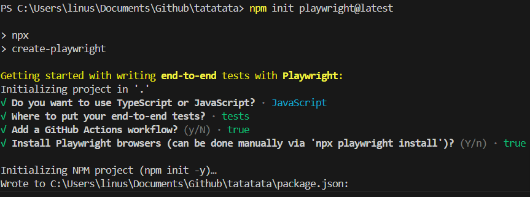

**Cypress Installation**

<a name="bilaga-4"></a>

`npm init` [Tillbaka [4]](#back-4)

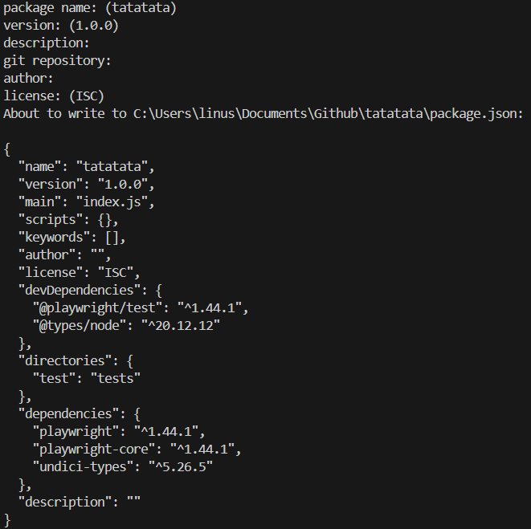

<a name="bilaga-5"></a>

`npm install cypress --save-dev` [Tillbaka [5]](#back-5)

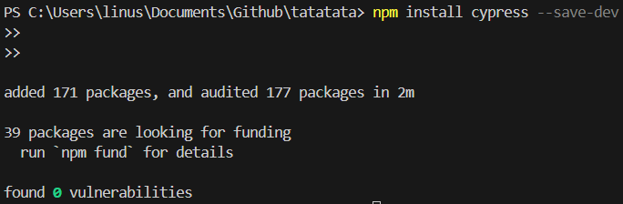

<a name="bilaga-6"></a>

`Parallell körning av de webbläsare som Playwright stödjer.` [Tillbaka [6]](#back-6)

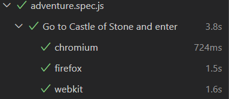

**Playwright selektor**

<a name="bilaga-7"></a>

`Playwrights symbol för selektorn är tre cirklar/måltavla` [Tillbaka [7]](#back-7)

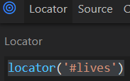

**Cypress selektor**

<a name="bilaga-8"></a>

`Cypress symbol för selektorn är ett sikte` [Tillbaka [8]](#back-8)

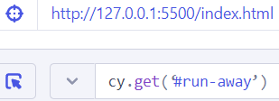

<a name="bilaga-9"></a>

`Playwrights show-report UI` [Tillbaka [9]](#back-9)

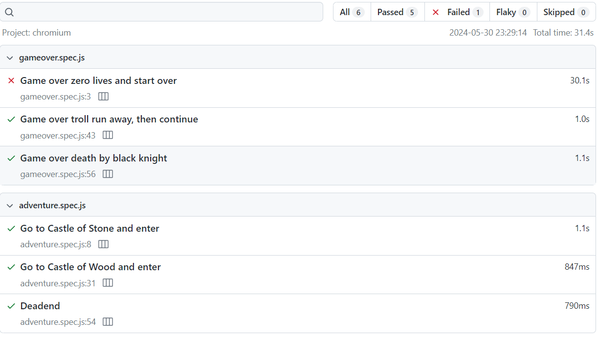

<a name="bilaga-10"></a>

`Cypress show-report UI` [Tillbaka [10]](#back-10)

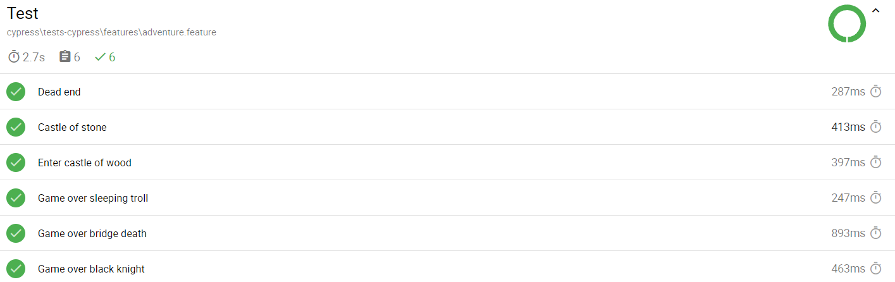

<a name="bilaga-11"></a>

`Cypress test UI` [Tillbaka [11]](#back-11)

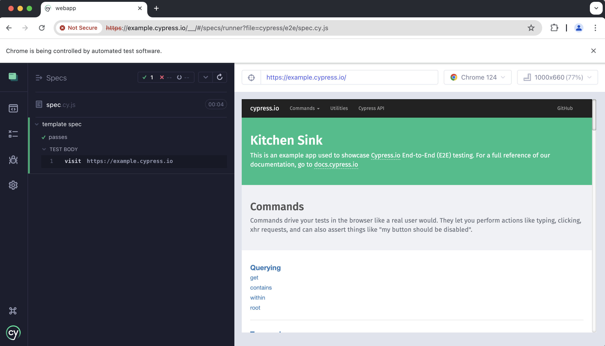

<a name="bilaga-12"></a>

`Playwright test UI` [Tillbaka [12]]](#back-12)

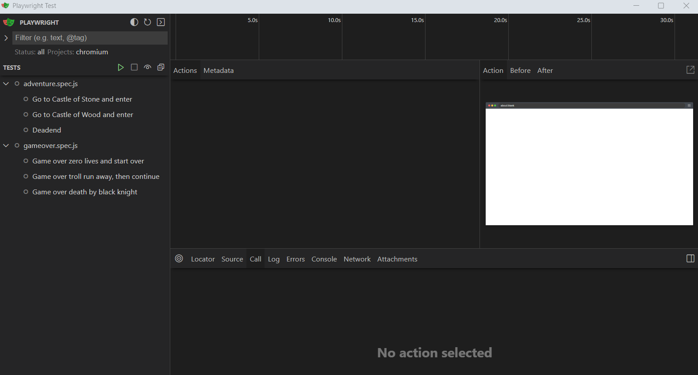
