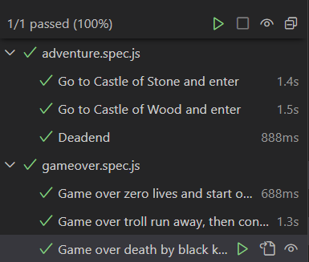
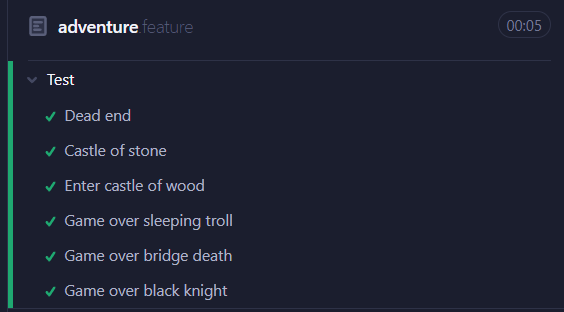

# Titel

| Namn                  | Ange för- och efternamn                                         |
| --------------------- | --------------------------------------------------------------- |
| Utbildning            | Ange vilken utbildning du läser                                 |
| Uppdrags-givare       | ``Om du gjort exjobb på ett företag, annars tas denna ruta bort |
| Handledare/examinator | Ange vem som handlett/examinerat examensarbetet                 |
| Datum                 | Ange datum för inlämning                                        |

# Sammanfattning

Detta är en sida som skall sitta direkt efter titelsidan. Den innehåller först och främst en sammanfattning av innehållet i rapporten. Sammanfattningen ska innehålla bakgrund/inledning, beskrivning av examensarbetets genomförande samt resultat i korthet.

I sammanfattningen ska det endast redovisa resultat, slutsatser eller annat som finns med i själva arbetet. Finns det inte med i texten ska det inte stå med här.

Lista över förkortningar och begrepp

Inled arbetet med att lista (i bokstavsordning och gärna i tabellformat) alla förkortningar och begrepp som används i rapporten. Även för en tekniskt kunnig person kan det vara svårt att hålla betydelsen av alla förkortningar i huvudet och vissa förkortningar/begrepp som används i olika sammanhang, kan ha olika betydelser.

Denna rubrik kan tas bort om det inte finns begrepp och förkortningar som behöver förklaras.

Översätt inte bara förkortningens innebörd, utan förklara med egna ord vad det är för något. Till exempel:

| Akronym | Hela namnet           | Beskrivning                                                                                              |
| ---     | --------------------- | -------------------------------------------------------------------------------------------------------  |
| UI      | User Interface        | Det vi som användare ser när vi besöker en hemsida samt interaktionen mellan sidan och användaren        |
| ``      | ``                    | ``                                                                                                       |

Innehåll

# 1. Inledning

<!-- Här börjar rapportens huvuddel. Huvuddelen skall delas in i numrerade kapitel och, i förekommande fall, i numrerade underavsnitt med beskrivande underrubriker. Hur indelningen med kapitelrubriker och underrubriker ska göras styrs i hög grad av det ämne som rapporten behandlar. Här visas enbart ett exempel. Ni får god hjälp hur ni skall bygga upp och skriva rapporten genom att studera litteratur om rapportskrivning, samt den instruktion som ges på kursen. Disposition och utformning av rapporter inom teknikområdet följer ofta speciella traditioner.

Sidorna i huvuddelen numreras löpande med början på 1. Genomgående i denna mall används teckensnittet Times New Roman (textstorlek 12 och 1,15 radavstånd) med följande undantag:

* i rubriker används Arial fet,
* för listning av programkod används Courier

Observera att varje yrkeshögskoleanordnare eventuellt har egna formaliaregler och instruktioner kring detta.

I examensarbetets inledning ska ni ge en kortfattad inledning till varför ni just valt detta område/ämne. Om ni skriver examensarbetet kopplat till LIA ska ni även beskriva er LIA-plats samt övergripande information om LIA-företaget. -->

## 1.1 Bakgrund

Under min tid på LIAn testade vi olika produkter mest med Cypress, men vi fick även tips om ett testverktyg som heter Playwright. Jag har därför valt att jämföra Cypress och Playwrights för- och nackdelar. Huvudsaken till varför jag valde Playwright är för det känns relevant att testa ett modernare testverktyg mot ett äldre.

Cypress är ett front-end testverktyg som underlättar för programvarutestare att automatisera olika handlingar man gör när man besöker en sida. Handlingar i det här fallet är t.ex. att klicka på en knapp eller att kolla om en selektor existerar där den ska vara. Automatiseringen av dessa handlingar görs med hjälp av kod man skriver i Javascript. Det finns även ett skript man kan använda för att starta en UI över vad testkoden gör.

Anledningen till att man automatiserar dessa handlingar är för att selektorerna på en sida kan uppdateras över tid. En annan anledning är att det är mycket mer effektivt och sparar tid från att behöva manuellt testa allting varje gång.

<!-- Under rubriken bakgrund skall ni beskriva bakgrunden till arbetet. Det är orsakerna till och beskrivningen av problemet, eller företagets situation, som skall beskrivas.

Beskriv vad ni ska göra i projektet och varför ni gör projektet. Som läsare vill jag förstå varför en fördjupning inom det här området har ett värde för yrkeskåren, er eller er kompetens när ni ska ut i arbetslivet. -->

## 1.2 Syfte

<!-- Varför gör ni undersökningen och vad vill ni att undersökningen skall leda till. Själva syftet ska formuleras i en mening: ”Syftet med arbetet/uppsatsen är att......” -->
Syftet med arbetet är att jämföra de två olika testverktygen Cypress och Playwright för att få en överblick över deras styrkor och svagheter och avgöra vilket testverktyg som ska användas för olika typ av testning.

## 1.3 Problemformulering

<!-- Här beskriver ni vilket problem ni står inför. Försök att besvara frågan:

Vad ska göras i arbetet? Med utgångspunkt från syftet ska ni här formulera konkreta frågeställningar. Ni skall visa hur ni valt att strukturera och dela upp syftet med er undersökning. Frågeställningarna bör inte vara färre än tre eller fler än fem. Tänk på att göra problemformuleringen så snäv som möjligt så inte undersökningen blir för stor. -->

<!-- Frågeställningarna ska inte vara ja-och nejfrågor utan öppna frågor, t.ex. hur kan… på vilket sätt… ? -->

Hur bra grafiskt gränssnitt har Playwright jämfört med Cypress?

Hur användarvänligt är Playwright jämfört med Cypress?

Hur lätt är det att skriva testkoden i Playwright jämfört med Cypress?

Hur lätt är det att komma igång med Playwright jämfört med Cypress?

Hur bra förklarat är testkoden i Playwright jämfört med Cypress?

## 1.4 Avgränsningar och fokus

<!-- Här gör ni ett förtydligande av vad ni avser att INTE studera i ert arbete. Detta görs för att det inte ska finnas förväntningar från opponent/läsare att det finns med. Att välja fokus är att avgränsa sig på ett mjukare sätt. Att välja fokus innebär att studenten motiverar varför vissa inriktningar väljs eller väljs bort. -->

## 1.5 Metod/Arbetssätt

Jag har för avsikt att avgöra om vilket testverktyg mellan Playwright och Cypress som är bäst genom att testa dem på ett spel. Testerna utgår ifrån dokumentation som har skrivits för de två olika testverktygen.

<!-- Hur ska arbetet/undersökningen genomföras? Alla undersökningar genomförs med kända och väl verifierade metoder. Dessa lämpar sig för olika typer av syften. Det är viktigt att metoden överensstämmer med syftet, liksom att ni väljer rätt verktyg för undersökningen av problemet.

Vi har för avsikt att: (någon av följande)

Beskriva (händelser, tillstånd, förlopp, handlingar för att därur kunna dra slutsatser för beslut. För att vara meningsfull måste varje beskrivning återkopplas till syftet.)

Förklara (Ert syfte är att göra en modell av verkligheten för att den lättare skall kunna förklaras)

Förstå (ni söker kunskap om vissa förhållanden)

Förutsäga (Hur ser vår prognos inför framtiden ut?)

Besluta (Vilka är handlingsalternativen inför ett beslut?)

Ni ska i första hand använda kvalitativ och/eller en kvantitativ metod för er undersökning. Beroende på vad som ska undersökas, kan enbart en av metoderna användas.

Kvalitativa metoder (det är vad som kommer fram i svaren som är det viktiga, inte antalet svar):

- Observationer
- Intervjuer

Kvantitativa metoder (det är antalet svar som är viktiga, inte vad svaret är eller varför):

- Statistiska verktyg
- Enkäter

Gäller praktiskt arbete:

Beskriv systematiskt och tydligt vad och hur ni gjort. När ni redovisar det praktiska arbetet är det viktigt att systematiskt beskriva de olika delarna av arbetet och resonera för- och nackdelar med gjorda val.

Använd figurer och bilder i den här rapporten för att beskriva särskilt intressanta delar av det praktiska arbetet.

Gäller teoretiskt arbete:

Beskriv systematiskt och tydligt vad och hur ni gjort. Inkludera all information som behövs för att läsaren ska förstå och få förtroende för det ni har gjort, dvs att arbetet har gjorts på ett pålitligt sätt.

Det vara en fördel att beskriva ordningen på de olika momenten eller beskriva de olika arbetssätten ni valt. Ibland kan det vara en fördel att använda bilder och figurer för att förklara på ett bra sätt. -->

# 2. Teori

<!-- Uppsatsen teori handlar om att ”beskriva det som redan är skrivet”. Utifrån syfte och problemformulering letar ni upp lämplig teori där ni kan fördjupa er i frågeställningarna. Teorin ska knytas till det undersökningsresultat du/ni kommit fram till. Detta ska bekräftas eller dementeras.

Teorin kan t.ex. hämtas från:

* alternativa undersökningar
* vetenskapliga artiklar
* kurslitteratur eller annan litteratur

Källhänvisningar:

Under teoriavsnittet är det viktigt att ni gör källhänvisningar till allt ni skriver.

Nedanstående är exempel på de vanligaste systemen. Följ systemet angivet av utbildningsanordnare eller examinator.

* APA
* Harvardsystemet
* Oxfordsystemet

Kom ihåg att alltid vara källkritisk när ni arbetar med olika källor. Ställ frågor till aktuell källa:

* Vem har skrivit och i vilket syfte?
* Bekräftas källan av andra?
* Var är den publicerad, i en vetenskaplig/akademisk publikation eller i en veckotidning?

Sådana fakta som är självklar behöver inte refereras (tex. vi lever på 2000-talet). Detta är common sense. Det är bra att visa att man har gått till flera källor för att få något bekräftat eller för att visa på olika perspektiv/synsätt i en fråga.

Nätbaserade källor hänvisas med URL. Den första av internetkällor heter då URL1, andra URL2 etc. Hela internetlänken placeras sedan i referenslistan under en egen rubrik där.

Tabeller & Figurer

Under alla figurer måste anges figurnummer och figurtext. Figurer i kapitel X numreras löpande, Figur X.1, Figur X.2 etc. I löpande text refererar man till figurerna genom att skriva exempelvis ’Experimentuppställningen visas i Figur 3.2’. Tabeller numreras löpande liksom figurerna, Tabell X.1, Tabell X.2 med tabelltexten ovanför tabellen. -->

# 3. Resultat

## 3.1 Hastighet

Playwrights tester körs parallellt med varandra, vilket kan drastiskt öka hur snabbt alla tester genomförs. När testerna genomförs med Cypress exekveras testerna en efter en. I Playwright finns det en tid som går att observeras för varje test. I Cypress finns en total tid för alla tester, men inte för varje enskilt test.

**Playwrights tester** 

**Cypress tester**

## 3.2 Användervänlighet
### Testkörning

**Playwright**
1. Skriv kommandot/skriptet: `npx playwright test --ui` i terminalen.
2. Ett fönster bör dyka upp med det grafiska gränsnittet för testerna.
3. Starta testerna.

**Cypress**
1. Skriv kommandot/skriptet: `npx cypress open` i terminalen.
2. Ett fönster bör dyka upp.
3. Tryck på E2E testing.
4. Tryck på den webbläsare du vill använda för testning.
5. Tryck på den fil du vill testa.
6. Starta testerna.

Ovan ser ni att Playwright har en enklare process för att starta testerna i det grafiska gränssnittet. Det som Cypress vinner på är kommandot/skriptet, vilket är aningen kortare. Det är dock ingen större vinst, eftersom namnet på skriptet manuellt kan ändras i package.json filen.

### Browsers

Playwright 

<!-- Här redovisar ni objektivt och utan värderingar era iakttagelser på ett strukturerat sätt vad ni kommit fram till i er undersökning/arbete. Hur blev det? Vad blev resultatet?

När ni redovisar ert resultat ska ni inte blanda in egna upplevelser, känslor eller någon analys. Ni ska enbart beskriva utfallet på er undersökning/arbete och enbart det som är centralt för resultatet. Så den här texten och/eller redovisning är saklig, formell och ”torr” och ni sparar era personliga reflektioner till texten under rubriken Diskussion. Mottagaren ska kunna se en röd tråd som löper från Bakgrund med syftet, avgränsningar och metodbeskrivning, och tydligt se hur detta leder fram till resultatet.

Har ni ställt frågor enligt ett frågeformulär är det lämpligt att redovisa svaren i en figur eller tabell. -->

# 4. Diskussion

<!-- Här formulerar ni svaren på era frågeställningar och kontrollerar och reflekterar över om rapporten uppfyller syftet.

Stämde era antaganden? Löstes problemet? Förklara om det blev som ni tänkt er, beskriv vad ni lärt er och vad ni kunnat göra annorlunda för att få ett bättre resultat. Koppla tillbaka till de beslut som har fattats under resans gång och konsekvenserna av dem. Om något blev fel, så är det helt okej att berätta det här och beskriv vad ni lärt er av det och kanske hur det påverkat utfallet/resultatet.

Ni kan även diskutera noggrannheten/tillförlitligheten i arbetet och beskriva om det skiljer sig från liknande arbeten. Om ni har kommit fram till något annat resultat än andra som gjort liknande arbeten, beskriv varför ni tror att det är så.

Tänk på att inte låta den här texten bli full av undanflykter och ursäkter, utan snarare en saklig reflektion. -->

# 5. Slutsatser

<!-- Utifrån den analys ni gjort i avsnittet ovan kan ni dra slutsatser utifrån syfte och frågeställningarna. Ett visst mått av subjektivitet är tillåtet men det måste vara motiverat av det som framkommit i uppsatsens analys.

Ibland går det dock inte att dra några säkra slutsatser, det ligger i forskningens natur, vilket också är ett resultat. Man förklarar då varför det inte gick att dra säkra slutsatser. -->

## 5.1 Rekommendationer

<!-- Baserat på vad ni kommit fram till samt på undersökningens syfte, avger ni här er yrkesmässiga/professionella rekommendation till dem som kan dra nytta av undersökningens resultat. Här kan ni tänka fritt och diskutera ämnet ur ett mer subjektivt perspektiv. -->

# 6. Referenslista

<!-- De källor ni använt ska redovisas i en referenslista. Den ska vara på ett eget blad och sist i arbetet.

I källförteckningen anger ni den litteratur ni har hänvisat till i texten. Referenslistan presenteras alltid i alfabetisk ordning. Han ni väldigt många källor kan ni även dela upp dessa i litteratur, internet, artiklar och muntliga källor. Glöm inte ange datum för internet och muntliga källor. Tips på hur du sammanställer en referenslista finns i anordnarens eller examinatorns guider.

Nedan finns exempel på de olika systemen.

Litteraturförteckning

Exempel APA

Bok - 1 författare

Ejlertsson, G. (2019). Statistik för hälsovetenskaperna (3 uppl.) Studentlitteratur.

Bok – 2 författare
Aldskogius, H., & Rydqvist, B. (2018). Den friska människan: anatomi och fysiologi. Liber

Internet

Folkhälsomyndigheten. (8 oktober 2019). Sjukdomsinformation om influensa. https://www.folkhalsomyndigheten.se/smittskydd-beredskap/smittsamma-sjukdomar/influensa-/

Browserstack. (14 Februrari 2023) Cypress vs Selenium: Key Differences. https://www.browserstack.com/guide/cypress-vs-selenium 

Exempel Harvard

Bok – 1 författare

Eklund, K. (2017). Vår ekonomi: en introduktion till samhällsekonomin.14 uppl., Lund: Studentlitteratur
Bryman, A. & Bell, E, Företagsekonomiska forskningsmetoder, 2. uppl., Stockholm: Liber AB, 2014. ISBN: 978-91-47-09822-4

Internet

Rhodin, M. (2018). Projekt Islandshäst. Rörelseforskning på häst och ryttare – en forskarblogg från SLU. [Blogg]. 17 maj. http://blogg.slu.se/rorelseforskning/2018/05/17/projekt-islandshast/ [2020-02-06] -->

# Bilagor

<!-- I bilagor samlas allt som inte är nödvändigt för att följa och förstå framställningen i huvuddelen, t.ex. intervjufrågor, materialdata, omfattande beräkningar och programkoder eller detaljerade metodbeskrivningar. Här kan man också placera figurer som är för stora för att infoga i den löpande texten. Bilagorna skall utformas så att de kan fungera som självständiga dokument, dvs man skall inte behöva läsa i huvuddelen för att kunna förstå innehållet i respektive bilaga. Bilagornas sidor numreras för sig.

--- -->
